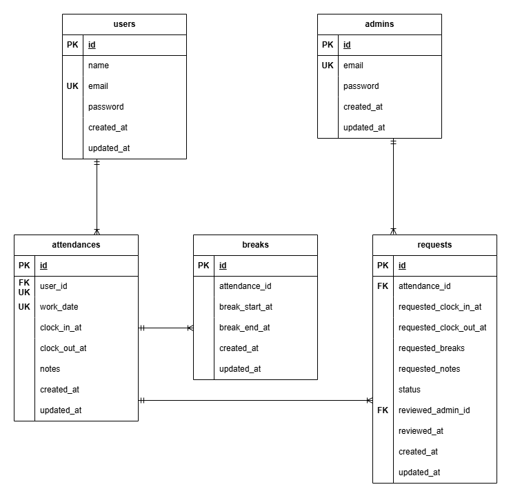

# coachtech-attendance
提出タグ:

## 環境構築手順

### 1. Docker ビルド
```bash
git clone https://github.com/koshikawa-minori/coachtech-attendance
cd coachtech-attendance
docker-compose up -d --build
```

### 2. Laravel 環境構築
```bash
docker-compose exec php bash
composer install
cp .env.example .env  #環境変数を変更
```
- DB 接続情報（docker-compose.yml の設定と一致させる）

- キャッシュ設定（`.env` の CACHE_DRIVER を `file` に変更してください。）

```bash
php artisan key:generate
php artisan migrate
php artisan db:seed
```

## 使用技術（実行環境）
- PHP 8.2+
- Laravel 12.x
- MySQL 8.0
- nginx 1.21

## ER図


## 開発環境URL
- 一般ユーザーログイン: http://localhost/login
- 管理者ログイン: http://localhost/admin/login
- phpMyAdmin: http://localhost:8080/

## テストユーザー情報

| ユーザー種別 | メールアドレス | パスワード |
|---------------|----------------|-------------|
| 一般ユーザー | test@example.com | password |
| 管理ユーザー | admin@example.com | password |

※本アプリではメール認証を実装しています。
一般ユーザー（reina.n@example.com）は未認証のため、
ログイン前にメール認証を完了させてください。


## メール認証機能（応用）

本アプリでは**Mailtrap**を利用して
新規会員登録時にメール認証を行います。

### メール認証手順

1. `.env` に Mailtrap の `MAIL_USERNAME` / `MAIL_PASSWORD` を設定
2. `/register`（会員登録画面）で新規登録を行う
3. 登録直後に認証メールを送信し、 `/register/verify`（メール認証誘導画面）へ遷移
4. 「認証はこちらから」ボタン押下で`/email/verify`（メール認証画面）へ遷移
5. 認証メール内のリンクをクリックすると、
  新しいタブで `/email/verify/{id}/{hash}` にアクセスし認証完了、その後プロフィール設定画面が開く

- 認証が未完了のままログインした場合も認証誘導画面へ遷移
- 認証メールの再送機能あり（1分間に6回まで）

## テストコード

**PHPUnit**を用いたテストケースを作成しています。

### 1.テスト用データベース作成
```bash
docker-compose exec mysql bash
mysql -u root -p
# パスワード入力後に以下を実行
CREATE DATABASE test_db CHARACTER SET utf8mb4 COLLATE utf8mb4_unicode_ci;
exit
exit
```

### 2. .env.testing を作成（プロジェクト直下）
```env
APP_ENV=testing
APP_KEY=

DB_CONNECTION=mysql
DB_HOST=mysql
DB_PORT=3306
DB_DATABASE=test_db
DB_USERNAME=root
DB_PASSWORD=root

CACHE_DRIVER=array
SESSION_DRIVER=array
QUEUE_CONNECTION=sync
MAIL_MAILER=log
```
### 3.テスト用マイグレーション実行
```bash
docker-compose exec php bash
php artisan migrate --env=testing
exit
```

### テスト実行方法
以下のどちらかのコマンドで
すべてのFeatureテストを実行できます。

#### Laravel の Artisan コマンドを利用
```bash
php artisan test
```
#### PHPUnit コマンドを利用
```bash
./vendor/bin/phpunit
```
